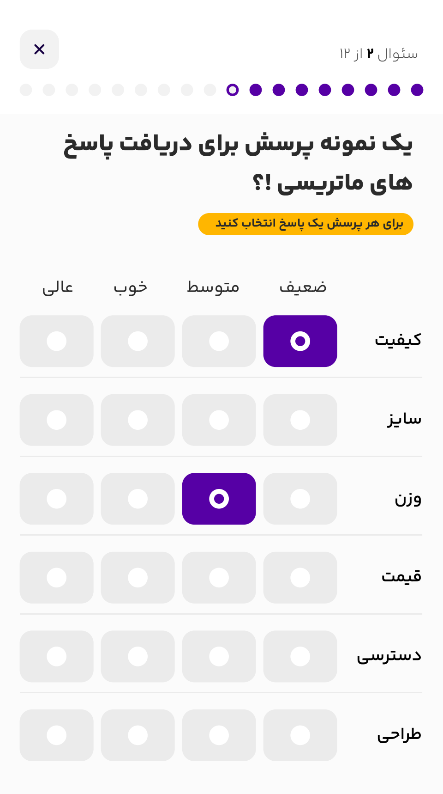

<h1>
سند مصاحبه فنی - شرکت داده‌نگار
</h1>

---

<h3>
با سلام و عرض احترام،

این چالش در رابطه با طراحی و پیاده سازی هسته ی عملکرد یک پلفرم ساخت پرسشنامه است.
 در این پلتفرم کاربران می توانند به پرسشنامه های ساخته شده توسط دیگران، پاسخ دهند.
به عنوان نمونه می توان به پرسشنامه ساز 
[Typeform](https://www.typeform.com/)
 اشاره کرد.
</h3>
<h2>
توضیحات:
</h2>
<h3>
<ol>
  1. مدل سازی پایگاه داده:

    ساخت مدل های پرسشنامه، سوال، پاسخ و کاربر و دیگر مدل ها بر حسب نیاز.
</ol>
<ol>
  2. ساخت APIها:

    ساخت APIهای ایجاد پرسشنامه، سوال، پاسخ به پرسشنامه و گزارش گیری.
</ol>
<ol>
  3. ایجاد Documentationهای  خودکار برای APIها
</ol>
<ol>
  4. ایجاد Unit Testهای مناسب برای APIها (حداقل 4 مورد)
</ol>
<ol>
  5. ایجاد یک تسک Periodic برای آرشیو کردن پرسشنامه های قدیمی
</ol>
<ol>
  6. Dockerize کردن سرویس های مورد استفاده با docker-compose
</ol>
</h3>
<h2>
معیارهای ارزیابی:
</h2>
<ol>

    1. رعایت قواعد SOLID.
    2. رعایت قواعد مرتبط با Clean Code.
    3. رعایت قواعد مرتبط با Clean Architecture (امتیازی).
</ol>
<h2>
ملاحضات:
</h2>
<ol>

    1. پرسشنامه باید از حداقل 4 نوع مختلف از سوالات پشتیبانی کند. پیاده سازی سوال از نوع ماتریسی حتما وجود داشته باشد.
       در این نوع سوال، کاربران برای هر پرسش یک پاسخ انتخاب می کنند. این سوال شامل چند زیر-پرسش (کیفیت-سایز-وزن-قیمت-دسترسی-طراحی) است که هر کدام می تواند با یک گزینه از بین مجموعه ای از پاسخ های از پیش تعیین شده (ضعیف-متوسط-خوب-عالی) جواب داده شود.

  

    2. stack مورد استفاده Dajngo + Celery باشد.
    3. نیازی به پیاده سازی سرویس لاگین و ثبت نام نیست.
    4. در صورت وجود هرگونه ابهام، با در نظر گرفتن فرضیات خودتان عمل کنید و همچنین آنها را توضیح دهید.
    5. پاسخ خود را در قالب یک Repository در گیت هاب بارگذاری نمایید و لینک آن را به آدرس ایمیل dadenegarcompany@gmail.com ارسال کنید.
</ol>

